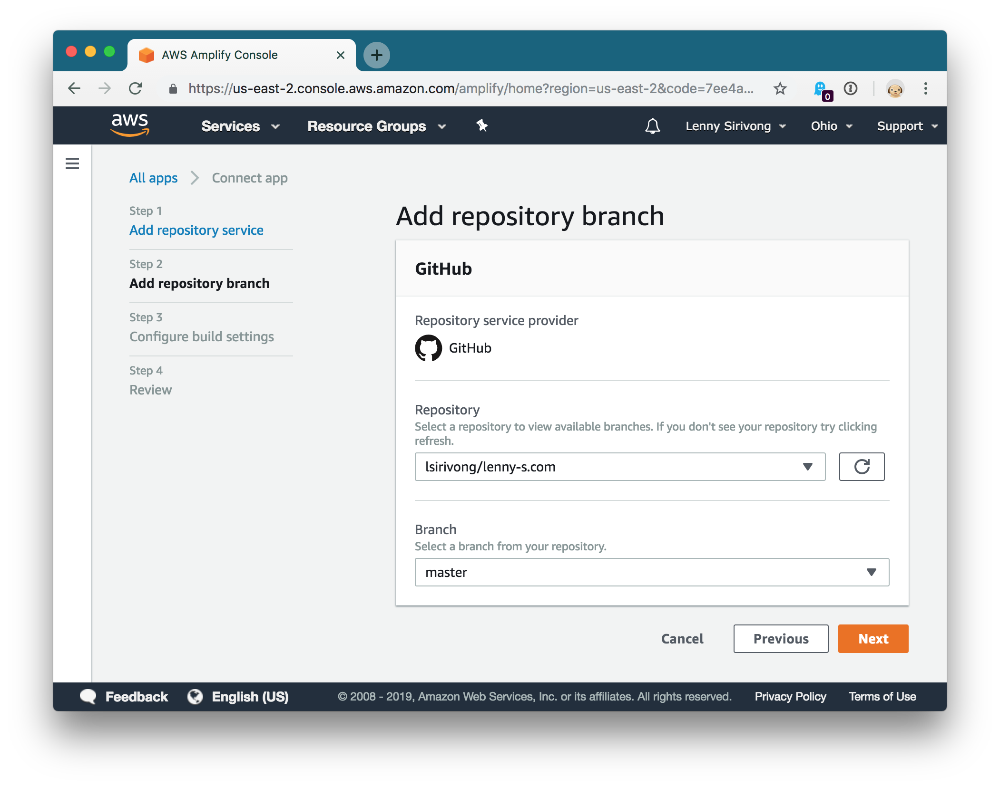
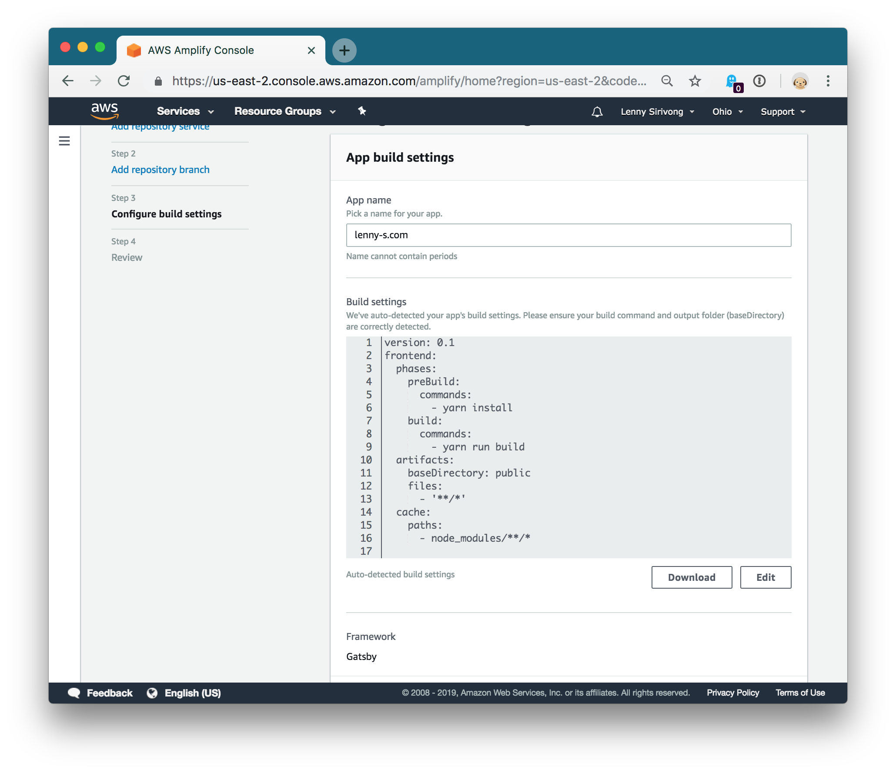
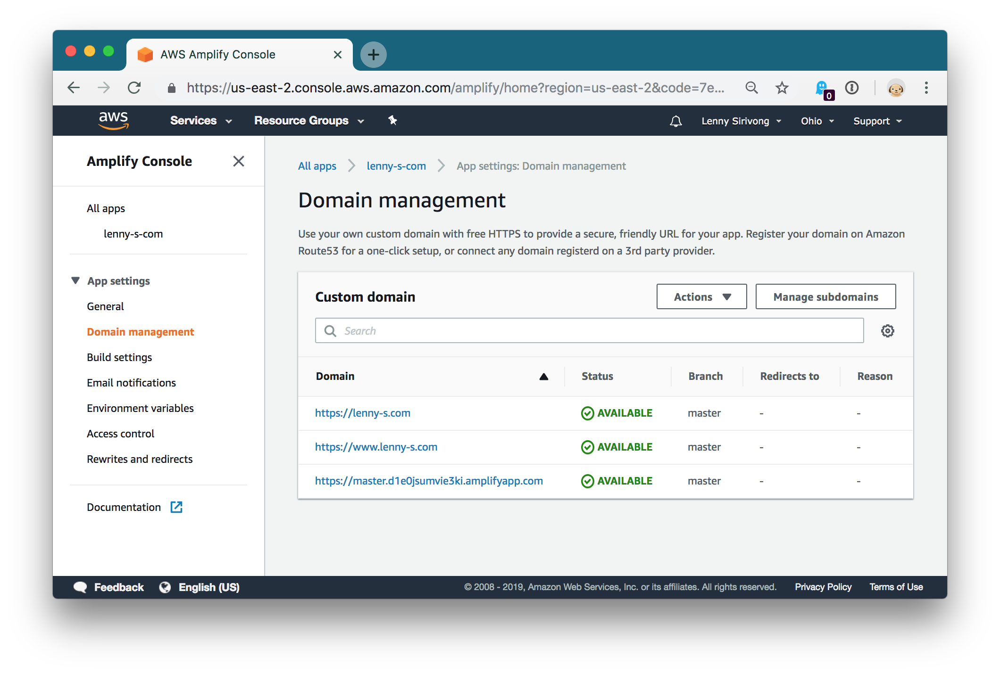
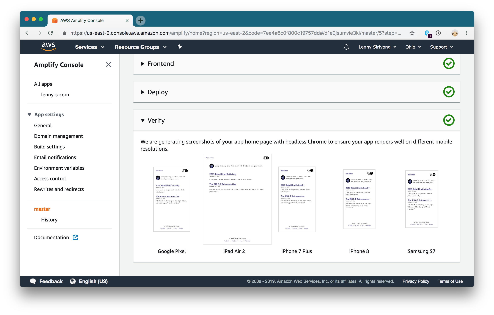

I needed to automate the deployment process of [this rebuilt version][1] of my
personal website. The original process involved a few manual steps of building and
syncing files to an S3 bucket, which was a fine first iteration - I was focused on
getting the initial structure and design in place. But, now that I'm starting to spruce
up the place a bit more regularly, I saw this as a good opportunity to try out
something I came across as I learned more about [Serverless][2] and [Cloudformation][3]...

## [AWS Amplify Console][4]

Static site deployment is already really easy: just put your files somewhere accessible
on the internet and you're good to go. But even a few manual steps become a chore to sit
through every update, and the piece of mind that all deployed code has been pushed to
Github is worth the effort to set up some kind of deployment pipeline.

## It's Automatic

Really, the deployment was set up mostly automatically. From the Amplify console, I
chose "Connect app" and from there I just had to authenticate my github account and
chose my repository. The rest was a matter of clicking "Next".

Amplify automatically detects the Gatsby framework and generates a build config with
all the steps needed to build and deploy.

Already I had my app running on AWS infrastructure at a publicly accessible URL.

Next, under "Domain Management" I could add my domain which is already managed under
Route53 which made the record creation, again, automatic.

The one gotcha here is that I had an existing `www` record which prevented adding
the domain with a permissions error. Once I delwted that, Amplify created a root
record, a `www` record to redirect to root, and set up some validation record
which I believe it uses to validate ownership for the free SSL cert they issue.

And that was it! My github repository now deploys the latest commits on master to my
live production site.

## Initial impressions

I haven't had much of a chance to explore many of the features of Amplify deployment
yet, but the initial set up was much easier than I expected, and the tight integration
with other AWS resources like Route53 worked without a hitch.

## Visual Verify

I like the way the deployment dashboard is laid out, listing the steps as "provision",
"build", "deploy", and "verify". This "verify" step was curious to me; it (at least
by default), generates headless chrome screenshots of your app at a variety of screen
resolutions.

Not quite a full automated test suite, but it's a pretty neat basic visual
test confirmation that you get for free.

## Slow Build Time (Out of The Box)

My builds right now take about 3-4 minutes on average, which I'm not too thrilled about.
By comparison, our initial set up on CircleCI gave us builds in the 10s of seconds after
the first time the build image is created.

I'm sure this can be optimized, but still, I'd be able to stand something a *little*
bit faster out of the box. As it stands, I'll want to dig into optimizing it sooner
rather than later.

[1]: /2019-rebuild-with-gatsby/
[2]: https://serverless.com/
[3]: https://aws.amazon.com/cloudformation/
[4]: https://aws.amazon.com/amplify/console/
